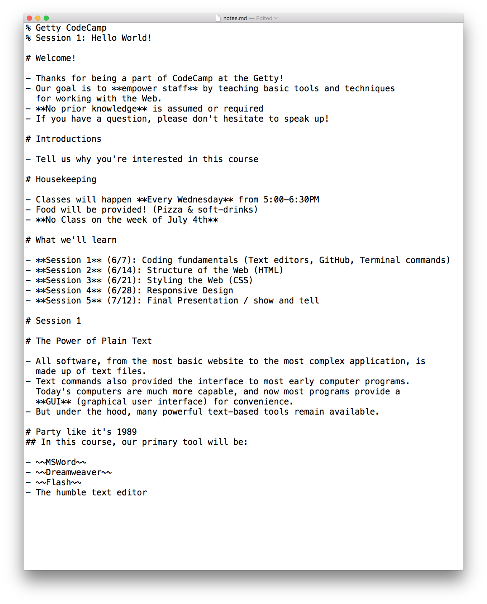
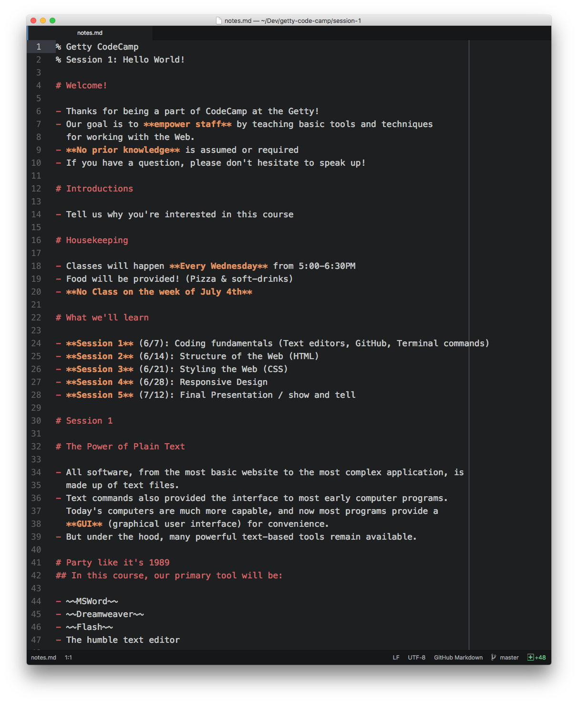
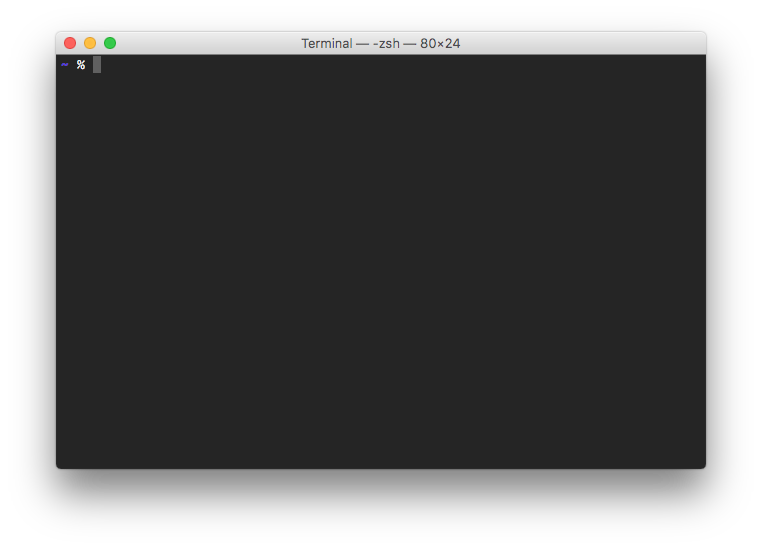

% Getty CodeCamp
% Session 1: Hello World!

## Welcome!

- Thanks for being a part of CodeCamp at the Getty!
- Our goal is to **empower staff** by teaching basic tools and techniques
  for working with the Web.
- **No prior knowledge** is assumed or required
- If you have a question, please don't hesitate to speak up!

## Introductions

- Tell us why you're interested in this course

## Housekeeping

- Classes will happen **Every Wednesday** from 5:00-6:30PM
- Food will be provided! (Pizza & soft-drinks)
- **No Class on the week of July 4th**

## What we'll learn

- **Session 1** (6/7): Coding fundamentals (Text editors, GitHub, Terminal commands)
- **Session 2** (6/14): Structure of the Web (HTML)
- **Session 3** (6/21): Styling the Web (CSS)
- **Session 4** (6/28): Responsive Design
- **Session 5** (7/12): Final Presentation / show and tell

# Session 1

## The Power of Plain Text

- All software, from the most basic website to the most complex application, is
  made up of text files.
- Text commands also provided the interface to most early computer programs.
  Today's computers are much more capable, and now most programs provide a
  **GUI** (graphical user interface) for convenience.
- But under the hood, many powerful text-based tools remain available.

## Party like it's 1989

- ~~MSWord~~
- ~~Dreamweaver~~
- ~~Flash~~
- The humble text editor

---



A Text Editor can very basic...

---



... or very powerful

---

## Fortunately, many of the best ones are free!

# InstallFest

## Everyone should install

- **Git** version control tool:
  - PC Users: Git for Windows (`git-for-windows.github.io`)
  - Mac users: `xcode-select --install`
- Optional: **GitHub Desktop** (`desktop.github.com`)
- **Atom Text Editor** (`atom.io/beta`)
- Make an account on GitHub.com if you don't have one yet

# Meet the Terminal

---



## Where to find it?
- Mac users: Terminal app
- PC users: Git Bash Shell

## What can I do with it?
- This is another interface to your computer; you can think of it as a parallel
  to the desktop
- You can access the same files and do many of the same tasks
- Instead of clicking on icons, you enter text into the **command line**

## Some simple commands
- Print your current working directory: `pwd`
- List all the files in a directory: `ls`
- List all files including hidden ones `ls -a`
- List files with a bunch of additional data: `ls -lh`
- Read a file with `cat` or `less`

## What's going on here?
 - `ls`, `cat`, `less` are _commands_, programs just like the icons in your Dock
 - `-a`, `-lh`, etc. are _arguments_: options you provide to the program to tell
   it what to do.

# Intro to Git

## What is Git?


## Git Basics

**Git** is a command-line program for _version control_. You can think of it
like MS Word's "track changes" feature, but applied to a folder full of files
instead of just one document.

It is powerful but also very complex. We will stick with the basics for this
course.

## Repositories

A **repository** is a collection of files and folders that Git is keeping track
of. You can turn any folder into a git repository by navigating to it in your
terminal and typing `git init`.

## Commits

The basic unit of Git is the **commit**. As you make changes to the files in
your repository, you can use `git commit` to take a snapshot. Only the changes
in files you explicitly add will be recorded in each commit.

A commit should contain a short description and an optional longer message
that explains what was changed.

---

Over time the commits in a repository can become a detailed history of all the
changes that have been made in a project. You can even "time travel" to revert a
change or undo a mistake made at any point in the past.

## Forking and Cloning

Git is also a _distributed_ version control system. This means that each
repository can be copied in many different locations.

**Cloning** lets you download an identical copy of a repository onto your
machine so you can edit it locally.

**Forking** lets you make a copy that is entirely your own, which you can
modify and redistribute however you see fit.

# Exercise 1

## Clone a repository and study it
```bash
git clone https://github.com/getty-code-camp/ex-1-1.git
cd ex-1-1
git status
git log
git checkout initial-commit
git checkout first-update
git checkout master
```

## Fork a repository
- Visit https://github.com/getty-code-camp/ex-1-1
- Click the "Fork" button in the upper right
- Clone a local copy: `git clone https://github.com/YOUR_USER_NAME/ex-1-1.git`
- Navigate to the project in your terminal

## Make some changes
```bash
# Create a new file
touch textfile_3.txt

# Edit this file in your editor.
# When you are ready, you can commit the changes:
# You can do this via the terminal or in Atom.
git add textfile_3.txt
git commit -m "Added a new file."
```

## Push those changes to GitHub
```bash
git push -u origin master
```
---

## Congratulations! You're a programmer!


